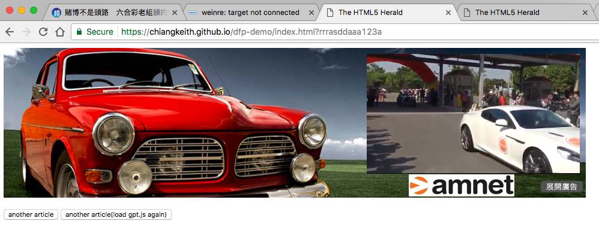
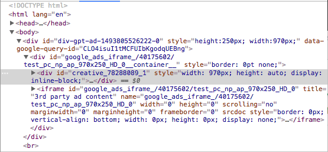
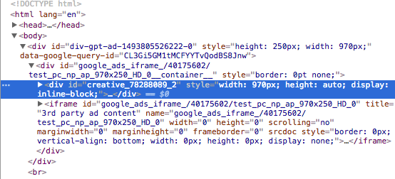
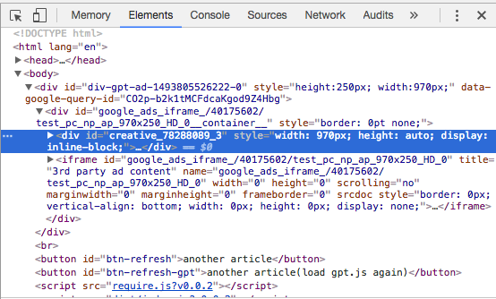

本例示範，在 SPA 中，取得廣告時，Enable.js 中 DART creative ID 被 register 情況。依以下測試步驟展示：

1. 進入頁面後直接呼叫廣告。
2. 點擊按鈕「another article」重新取得廣告。
3. 點擊按鈕「another article(load gpt.js again)」重新取得廣告。


### 1、 進入頁面後直接呼叫廣告。

```javascript
...
this.setUpAdBasic()
this.setUpAd()
this.displayAd()
...
```

其中 `this.setUpAdBasic()` 定義廣告讀取方式如下：

```javascript
setUpAdBasic() {
  window.googletag = window.googletag || {}
  window.googletag.cmd = window.googletag.cmd || []
  googletag.cmd.push(function() {
    googletag.pubads().enableSingleRequest()
    googletag.pubads().collapseEmptyDivs()
    googletag.enableServices()
  });
}
```

隨後定義廣告 `this.setUpAd()`

```javascript
setUpAd() {
  window.googletag = window.googletag || {}
  window.googletag.cmd = window.googletag.cmd || []
  googletag.cmd.push(function() {
    const slot = googletag.defineSlot('/40175602/test_pc_np_ap_970x250_HD'
               , [970, 250], 'div-gpt-ad-1493805526222-0').addService(googletag.pubads())
    slot.adid = 'div-gpt-ad-1493805526222-0'
    window.adSLot[ '/40175602/test_pc_np_ap_970x250_HD' ] = slot
  });
}
```

最後，秀出廣告

```javascript
displayAd() {
  window.googletag = window.googletag || {}
  window.googletag.cmd = window.googletag.cmd || []    
  googletag.cmd.push(function() { 
    console.log('show', window.adSLot[ '/40175602/test_pc_np_ap_970x250_HD' ].adid)
    googletag.display(window.adSLot[ '/40175602/test_pc_np_ap_970x250_HD' ].adid); 
  });
}
```



其中可見，廣告區域中已被寫入 `iframe` 與 `<div id="creative_xxxxxxx_1"></div>`，其中 creative id `creative_xxxxxxx_1` 猜測是由 **Enable.js** 註冊，其 id 最後的序號 `_1` 猜測是由 **Enable.js** 或由**寫入 creative div 的程式**自行編號。

而本例將透過兩個方式重新取得廣告，並觀察 creative id 變化。




### 2、點擊按鈕「another article」重新取得廣告。

點擊按鈕「`another article`」後，程式將執行以下動作：

```javascript
...
  googletag.destroySlots([ window.adSLot[ '/40175602/test_pc_np_ap_970x250_HD' ] ])
  delete window.adSLot[ '/40175602/test_pc_np_ap_970x250_HD' ]
  console.log('do refresh', window.adSLot)
  this.setUpAd()
  this.refreshAd()
...
```

其中透過 `googletag.destroySlots()` 刪除原本的廣告，隨後分別執行 `this.setUpAd()` 與 `this.refreshAd()` 重新定義廣告並秀出廣告。其中 `refreshAd()` 定義如下：

```javascript
refreshAd() {
  window.googletag = window.googletag || {}
  window.googletag.cmd = window.googletag.cmd || []    
  googletag.cmd.push(function() { 
    console.log('refresh', window.adSLot[ '/40175602/test_pc_np_ap_970x250_HD' ].adid)
    googletag.pubads().refresh([ window.adSLot[ '/40175602/test_pc_np_ap_970x250_HD' ] ]); 
  });
}
```


結果可見廣告區域被順利重新寫入  `iframe` 與 `<div id="creative_xxxxxxx_2"></div>` ，其中 creative id 為 `creative_xxxxxxx_2` 。

可見，僅是透過 `googletag.destroySlots()` 並無法改變 creative id 被註冊的情況， creative id 無法固定為序號 `_1`。



### 3、點擊按鈕「another article(load gpt.js again)」重新取得廣告。

既然僅僅透過 `googletag.destroySlots()` 無法取消 creative id 被註冊的情況，本步驟改以直接 reload `gpt.js`，看是否能取消被註冊的 creative id，儘管在做此測試範例前已大概猜測註冊 creative id 可能是由 Enabler 主導，此舉將毫無作用。

點擊按鈕 `another article(load gpt.js again)` ，程式將執行以下動作：

```javascript
...
  this.removeDfp()
  this.readGPTJs()
  this.setUpAdBasic()
  this.setUpAd()
  this.refreshAd()
...
```

其中 `removeDfp()` 定義如下：

```javascript
...
removeDfp() {
  for (const slotId in window.adSlots) {
    googletag.destroySlots([ window.adSlots[ slotId ] ])
    document.querySelector(`#${window.adSlots[slotId].adid}`).innerHtml = ''
  }
  window.adSlots = {}
  document.querySelector('head').removeChild(
  		document.querySelector('script[src*="googletagservices.com/tag/js/gpt.js"]')
  )
  window.googletag = undefined
}
...
```

`removeDfp()` 中，先逐一透過 `googletag.destroySlots()` 將原本的廣告刪除，再將原本載入 `gpt.js` 的 `script` 標籤移除，最後再將註冊在 object `window` 裡的 `googletag` 賦予 `undefined` 清除所有內容。

執行 `removeDfp()` 後，接著執行 `readGPTJs()` 如下：

```javascript
readGPTJs() {
  const gads = document.createElement('script')
  gads.async = true
  gads.type = 'text/javascript'
  const useSSL = document.location.protocol === 'https:'
  gads.src = (useSSL ? 'https:' : 'http:') + '//www.googletagservices.com/tag/js/gpt.js'
  const node = document.getElementsByTagName('script')[ 0 ]
  node.parentNode.insertBefore(gads, node)
}
```

`removeDfp()` 中，進行動態插入「`<script async="true" src="http://www.googletagservices.com/tag/js/gpt.js"></script>`」

開始載入 `gpt.js` 後，會分別執行 `this.setUpAdBasic()` 、`this.setUpAd()` 與 `this.displayAd()` 將廣告秀出。讀出廣告後可見 creative id 為 `creative_xxxxxxx_3` ，結果證明：光是透過 `googletag.destroySlots()` 或 reload `gpt.js` 是無法重置每個已被依註冊過的 creative id。



